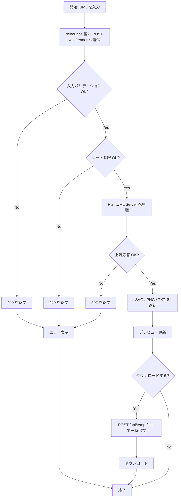

# アクティビティ図

利用者が UML を入力してから図を確認・出力するまでの処理フローを示します。

```mermaid
%%{init: {'theme': 'default', 'themeVariables': {'fontSize': '20px'}, 'flowchart': {'nodeSpacing': 60, 'rankSpacing': 80, 'curve': 'basis'}}}%%
flowchart TD
  A["開始: UML を入力"] --> B["debounce 後に POST /api/render へ送信"]
  B --> C{"入力バリデーション OK?"}
  C -- No --> D["400 を返す"]
  D --> E["エラー表示"]
  E --> Z["終了"]

  C -- Yes --> F{"レート制限 OK?"}
  F -- No --> G["429 を返す"]
  G --> E

  F -- Yes --> H["PlantUML Server へ中継"]
  H --> I{"上流応答 OK?"}
  I -- No --> J["502 を返す"]
  J --> E

  I -- Yes --> K["SVG / PNG / TXT を返却"]
  K --> L["プレビュー更新"]
  L --> M{"ダウンロードする?"}
  M -- Yes --> N["POST /api/temp-files で一時保存"]
  N --> O["ダウンロード"]
  O --> Z
  M -- No --> Z
```
