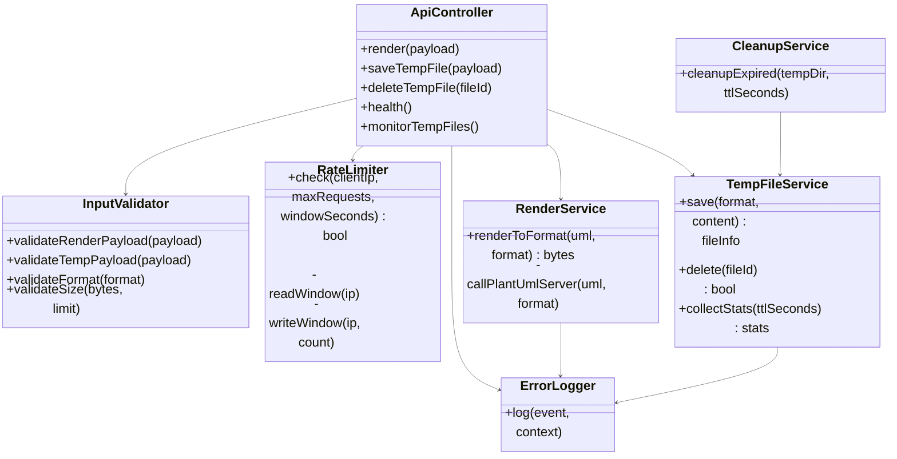

# クラス図

現状は単一 `index.php` 中心ですが、責務をクラス相当で分解した論理モデルを示します。

```mermaid
%%{init: {'theme': 'default', 'themeVariables': {'fontSize': '40px'}}}%%
classDiagram
  class ApiController {
    +render(payload)
    +saveTempFile(payload)
    +deleteTempFile(fileId)
    +health()
    +monitorTempFiles()
  }

  class InputValidator {
    +validateRenderPayload(payload)
    +validateTempPayload(payload)
    +validateFormat(format)
    +validateSize(bytes, limit)
  }

  class RateLimiter {
    +check(clientIp, maxRequests, windowSeconds) bool
    -readWindow(ip)
    -writeWindow(ip, count)
  }

  class RenderService {
    +renderToFormat(uml, format) bytes
    -callPlantUmlServer(uml, format)
  }

  class TempFileService {
    +save(format, content) fileInfo
    +delete(fileId) bool
    +collectStats(ttlSeconds) stats
  }

  class CleanupService {
    +cleanupExpired(tempDir, ttlSeconds)
  }

  class ErrorLogger {
    +log(event, context)
  }

  ApiController --> InputValidator
  ApiController --> RateLimiter
  ApiController --> RenderService
  ApiController --> TempFileService
  ApiController --> ErrorLogger
  CleanupService --> TempFileService
  RenderService --> ErrorLogger
  TempFileService --> ErrorLogger
```
