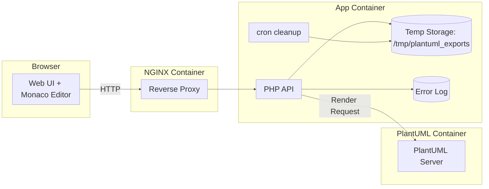

# コンポーネント図

コンテナ構成と主要コンポーネント間の依存関係を示します。

```mermaid
%%{init: {'theme': 'default', 'themeVariables': {'fontSize': '30px'}, 'flowchart': {'nodeSpacing': 80, 'rankSpacing': 80, 'curve': 'basis'}}}%%
flowchart LR
  subgraph browser[Browser]
    UI[Web UI + Monaco Editor]
  end

  subgraph edge[NGINX Container]
    NGINX[Reverse Proxy]
  end

  subgraph app[App Container]
    API[PHP API]
    TEMP[(Temp Storage: /tmp/plantuml_exports)]
    CRON[cron cleanup]
    ELOG[(Error Log)]
  end

  subgraph renderer[PlantUML Container]
    PUML[PlantUML Server]
  end

  UI -->|HTTP| NGINX
  NGINX --> API
  API -->|Render Request| PUML
  API --> TEMP
  CRON --> TEMP
  API --> ELOG
```
