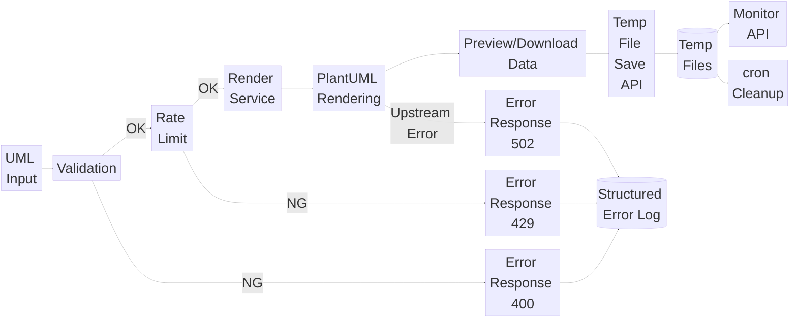

# データフロー図

入力データが検証・変換・保存・監視される流れを示します。

```mermaid
%%{init: {'theme': 'default', 'themeVariables': {'fontSize': '100px'}, 'flowchart': {'nodeSpacing': 100, 'rankSpacing': 80, 'curve': 'basis'}}}%%
flowchart LR
  I[UML Input] --> V[Validation]
  V -->|OK| RL[Rate Limit]
  V -->|NG| ER1[Error Response 400]

  RL -->|OK| RS[Render Service]
  RL -->|NG| ER2[Error Response 429]

  RS --> P[PlantUML Rendering]
  P --> OUT[Preview/Download Data]
  P -->|Upstream Error| ER3[Error Response 502]

  OUT --> SAVE[Temp File Save API]
  SAVE --> TMP[(Temp Files)]

  TMP --> MON[Monitor API]
  TMP --> CLN[cron Cleanup]

  ER1 --> LOG[(Structured Error Log)]
  ER2 --> LOG
  ER3 --> LOG
```
