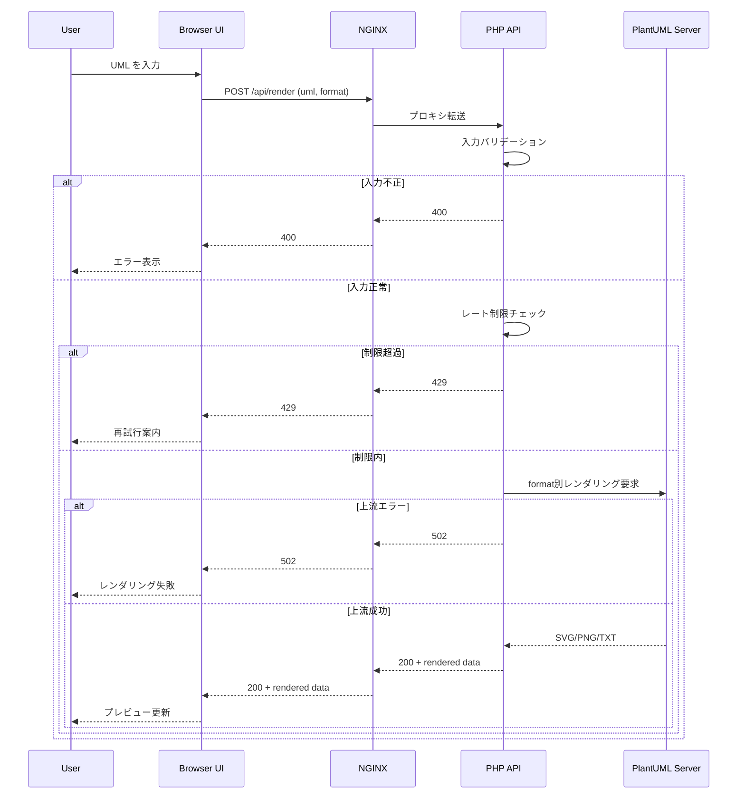

# シーケンス図

`/api/render` の成功時・失敗時を含む主要シーケンスを示します。

```mermaid
%%{init: {'theme': 'default', 'themeVariables': {'fontSize': '28px'}, 'sequence': {'diagramMarginY': 20, 'actorMargin': 80, 'messageMargin': 45}}}%%
sequenceDiagram
  participant User as User
  participant UI as Browser UI
  participant N as NGINX
  participant A as PHP API
  participant R as PlantUML Server

  User->>UI: UML を入力
  UI->>N: POST /api/render (uml, format)
  N->>A: プロキシ転送

  A->>A: 入力バリデーション
  alt 入力不正
    A-->>N: 400
    N-->>UI: 400
    UI-->>User: エラー表示
  else 入力正常
    A->>A: レート制限チェック
    alt 制限超過
      A-->>N: 429
      N-->>UI: 429
      UI-->>User: 再試行案内
    else 制限内
      A->>R: format別レンダリング要求
      alt 上流エラー
        A-->>N: 502
        N-->>UI: 502
        UI-->>User: レンダリング失敗
      else 上流成功
        R-->>A: SVG/PNG/TXT
        A-->>N: 200 + rendered data
        N-->>UI: 200 + rendered data
        UI-->>User: プレビュー更新
      end
    end
  end
```
