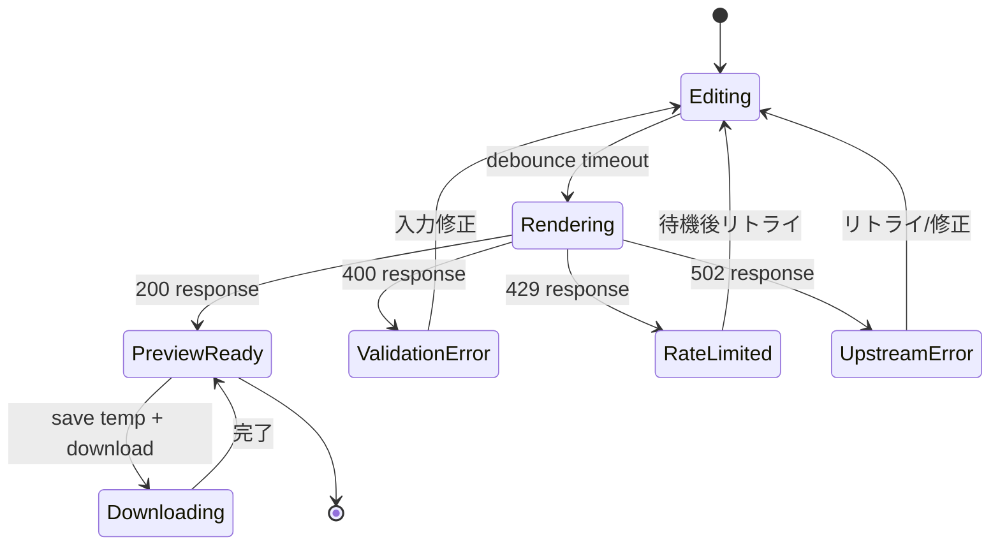

# 状態遷移図

ユーザーの編集セッションが辿る代表的な状態を示します。

```mermaid
%%{init: {'theme': 'default', 'themeVariables': {'fontSize': '20px'}, 'state': {'edgeLengthFactor': 1.2}}}%%
stateDiagram-v2
  [*] --> Editing
  Editing --> Rendering: debounce timeout
  Rendering --> PreviewReady: 200 response
  Rendering --> ValidationError: 400 response
  Rendering --> RateLimited: 429 response
  Rendering --> UpstreamError: 502 response

  PreviewReady --> Downloading: save temp + download
  Downloading --> PreviewReady: 完了

  ValidationError --> Editing: 入力修正
  RateLimited --> Editing: 待機後リトライ
  UpstreamError --> Editing: リトライ/修正

  PreviewReady --> [*]
```
