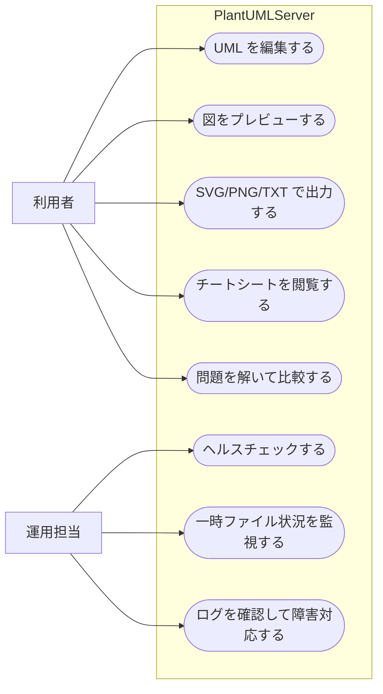

# ユースケース図

PlantUMLServer における主要アクターと利用機能の関係を示します。

```mermaid
%%{init: {'theme': 'default', 'themeVariables': {'fontSize': '20px'}, 'flowchart': {'nodeSpacing': 60, 'rankSpacing': 80, 'curve': 'basis'}}}%%
flowchart LR
  user[利用者]
  ops[運用担当]

  subgraph system[PlantUMLServer]
    uc1([UML を編集する])
    uc2([図をプレビューする])
    uc3([SVG/PNG/TXT で出力する])
    uc4([チートシートを閲覧する])
    uc5([問題を解いて比較する])
    uc6([ヘルスチェックする])
    uc7([一時ファイル状況を監視する])
    uc8([ログを確認して障害対応する])
  end

  user --> uc1
  user --> uc2
  user --> uc3
  user --> uc4
  user --> uc5

  ops --> uc6
  ops --> uc7
  ops --> uc8
```
